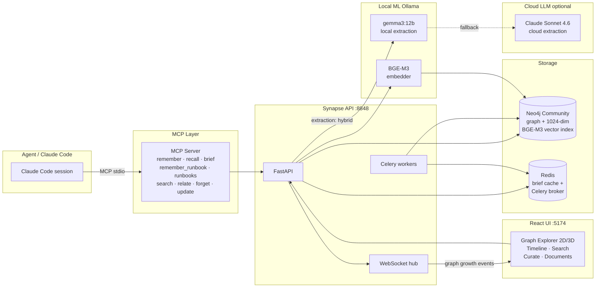

# Synapse

**A self-hosted, temporal knowledge-graph memory for AI coding agents** — shared across projects, queryable across time, written and read via MCP by any Claude Code session.

---

## What makes Synapse different

Most agent memory systems store a flat collection of text chunks with embeddings and retrieve by cosine similarity. That answers "what do I know?" — it cannot answer "what did I think in May, and when did that change?"

Synapse builds a **temporal knowledge graph** where every fact has a `valid_from` and `invalid_at` timestamp. When newer evidence contradicts old knowledge, the old node is **superseded, not deleted** — the full history of what was known and when is always queryable. This is the model Graphiti (the engine behind Zep) uses, and it changes the class of questions you can answer.

It also differs from raw graph databases: Graphiti handles entity resolution, temporal deduplication, and hybrid vector+graph retrieval out of the box. Synapse adds MCP tooling, multi-scope isolation (global / project / agent), cross-project knowledge linking, extraction-mode routing with credit-aware fallback, and a retrieval eval harness with a regression gate.

---

## What operating it found

Running this against eleven real projects surfaced a defect in Graphiti itself: its edge-invalidation
candidate search is unscoped, so an ordinary write silently retires unrelated facts that are still
true. No error, no warning — the fact just stops appearing in search results.

**Measured on this corpus: 70% of automatically-retired facts were still true** (28 of 40
hand-labelled cases, 95% CI [54.6%, 81.9%]). A separate structural method put it at 75.6%, inside
that interval — two methods sharing no mechanism, agreeing.

The write-up is the most interesting thing in this repository, and it includes the two measurements
that turned out to be wrong: **[docs/FINDING-silent-fact-loss.md](docs/FINDING-silent-fact-loss.md)**.
Reproduce it with `scripts/audit_invalidations.py`, `scripts/validate_invalidation_guard.py` and
`scripts/compare_guard_variants.py`.

The mitigation ships here (`_revert_unjustified_invalidations`); the real fix belongs upstream in the
candidate search, which is what [getzep/graphiti#1729](https://github.com/getzep/graphiti/pull/1729)
proposes.

---

[](https://github.com/alexsh88/synapse/actions/workflows/ci.yml)
[](https://www.python.org/downloads/)
[](https://opensource.org/licenses/Apache-2.0)

---


*The time slider re-renders the graph as it existed at any past date — then "Live" blooms it back to the present (~2,900 nodes).*

---

## Features

- **Temporal knowledge model** — every fact carries `valid_from` / `invalid_at`; knowledge is superseded, never deleted. "What did the agent believe in May?" is always answerable.
- **MCP tools for any Claude Code session** — `remember`, `recall`, `brief`, `remember_runbook`, `runbooks`, `search`, `relate`, `forget`, `update` wired into any project with a single JSON stanza.
- **`brief(project_id)` session-start context** — loads the distilled knowledge snapshot for a project at the start of every coding session; cached in Redis, served in milliseconds.
- **Hybrid extraction routing with credit-aware fallback** — `cloud` (Claude Sonnet 4.6), `local` (gemma3:12b via Ollama, $0), or `hybrid` (local → Sonnet on failure). When local embedding is unavailable, writes are queued and replayed rather than dropped silently.
- **Retrieval eval harness with regression gate** — golden set with positive, negative, and cross-project-leakage cases; hit@k **0.769** [0.654, 0.885], MRR **0.702** [0.587, 0.817], **0 violations** over 52 cases on the author's corpus, with 95% bootstrap intervals so a point estimate over 52 cases is never mistaken for a quality score. A >5% relative drop in hit@k or MRR, or *any* increase in violations, exits non-zero and blocks the run. Violations are gated absolutely, not relatively — a baseline containing any leak cannot be saved at all.
- **Fail-closed degraded-path design** — extraction failures go to a review queue; the write pipeline never silently discards knowledge. Health endpoints surface degraded state so operators know.
- **Curation with verify-no-loss safety** — dedup, decay, and archival tasks are gated by a `verify_no_loss` check that asserts no valid knowledge was removed before committing.

---

## Architecture



---

## Quickstart

**Prerequisites**

- Docker and Docker Compose
- [Ollama](https://ollama.ai) on the host with BGE-M3 pulled:
  ```bash
  ollama pull bge-m3
  ```
  _Or_ skip Ollama entirely and use cloud extraction instead (see the `.env` note below).

**Run**

```bash
git clone https://github.com/alexsh88/synapse.git
cd synapse

cp .env.example .env
# Open .env and set NEO4J_PASSWORD to any strong password.
# For cloud-only mode (no Ollama), also set:
#   EXTRACTION_MODE=cloud
#   ANTHROPIC_API_KEY=sk-ant-...

docker compose up -d
# Wait ~60 s for Neo4j to finish its first start.
# Six services come up: neo4j, redis, api, ui, worker, beat.
# `worker` and `beat` run the scheduled curation — nightly dedup and health scans, the
# consolidation proposal pass, and the pending-capture replay every 10 minutes.

open http://localhost:5174   # Graph Explorer UI
# API:          http://localhost:8848
# Neo4j Browser: http://localhost:7475  (user: neo4j, password: <your NEO4J_PASSWORD>)
```

**Wire a Claude Code project** (after the stack is healthy):

```bash
# 1. Register the project: copy projects.example.json to projects.json and add
#    an entry with your project's id, name, and path.
# 2. Wire it (writes .mcp.json + hook stubs into the target project):
python -m scripts.wire_project my-project
```

This writes `.mcp.json` and hook stubs into the target project. From then on every Claude Code session in that project can call `remember`, `recall`, and `brief`.

**Then check that it actually works:**

```bash
python -m scripts.doctor          # every registered project
python -m scripts.doctor .        # or one folder, no registry needed
```

Writing the config and being able to run it are different facts, and only the first one is easy to
check. `doctor` spawns the exact command each `.mcp.json` names, from that project's own folder,
and completes the MCP handshake — `initialize` → `tools/list`. Claude Code reports a server that
fails to start as `Failed to reconnect to synapse: -32000` and nothing else; this reports the exit
code, the stderr, and which of the nine tools came back. Exit status is 1 if any project fails, so
it can gate a rollout rather than be read by eye.

---

## Design decisions

The hard calls — graph engine, vector strategy, embedder, extraction routing — each have an ADR that records the trade-offs considered and the option rejected:

| ADR | Decision |
|-----|----------|
| [0001](docs/decisions/0001-graphiti-over-raw-neo4j.md) | Graphiti over raw Neo4j (entity resolution, temporal model, hybrid retrieval) |
| [0002](docs/decisions/0002-local-bge-m3-embeddings.md) | Local BGE-M3 via Ollama (zero per-token cost, the embedder Graphiti's paper used) |
| [0003](docs/decisions/0003-neo4j-native-vectors-over-qdrant.md) | Neo4j native vector index over Qdrant (redundant at this scale; one store) |
| [0004](docs/decisions/0004-temporal-supersede-model.md) | Temporal supersede model (valid_from/invalid_at; history always queryable) |
| [0005](docs/decisions/0005-mcp-as-agent-interface.md) | MCP as the agent interface (native Claude Code integration, zero wrapper code) |
| [0006](docs/decisions/0006-extraction-mode-routing.md) | Extraction mode routing (cloud/local/hybrid with credit-aware fallback) |

Deeper engineering notes live in [docs/ENGINEERING.md](docs/ENGINEERING.md).

---

## Testing

**776 tests** across unit, contract, and temporal-invariant suites, at 86% line coverage. They run against hand-written
Protocol fakes — no live Neo4j, Redis, Ollama or Anthropic — so `pytest` is the same command locally
and in CI. Live-service exercises are separate smoke scripts under `scripts/` (`mcp_smoke.py`,
`write_smoke.py`, `retrieve_smoke.py`), run by hand against a running stack.

The temporal-invariant tests (`tests/test_temporal_invariants.py`) assert on the Cypher queries emitted to Neo4j — verifying that `valid_from` / `invalid_at` constraints are written and enforced correctly, not just that the Python layer behaves.

```bash
# Full test suite
pytest tests/ -v

# Core engines only (fast, no live Neo4j needed)
pytest tests/test_curation_engine.py tests/test_retrieval_engine.py tests/test_graph_service.py -v
```

**Retrieval eval harness**

The eval harness runs the golden set against the live engine and scores hit@k, MRR, precision@k, and violations:

```bash
# Run against the live engine
python -m scripts.run_eval

# Save current run as the new baseline (writes synapse/eval/baseline.json, gitignored)
python -m scripts.run_eval --save-baseline

# Every subsequent run is the regression gate: exits non-zero if hit@k or MRR
# drops >5% relative, or if violations increase vs. the saved baseline.
python -m scripts.run_eval
```

On the author's corpus (4,651 fact edges as of 2026-08-19) the run over 52 cases measures:

| metric | value | 95% CI (percentile bootstrap, 10k resamples) |
|---|---|---|
| hit@k | 0.769 | [0.654, 0.885] |
| MRR | 0.702 | [0.587, 0.817] |
| precision@k | 0.464 | — |
| violations | **0** | — |

The saved baseline, recorded earlier, is hit@k 0.827 / MRR 0.743, so the gate currently reports a
7.0% / 5.5% relative drop. **The confidence intervals contain both**, which is the honest reading:
at n=52 this harness cannot distinguish the two runs, and three of the four newly-missing cases sit
in scopes that took automatic edge invalidations in the intervening weeks. It is reported rather
than re-baselined, because banking a lower number to silence a gate is how gates stop meaning
anything — the same reasoning `save_baseline` already applies to violations.

Three caveats worth stating plainly. The 52-case set is the author's private one
(`cases_private.py`, gitignored — it names real projects); what ships publicly is a 15-case demo set
over fictional `acme-*` projects, so a clean run of the committed code reproduces the *harness*, not
these numbers. The set has been used while tuning, which makes it a regression gate rather than an
unbiased quality estimate. And n=52 is small enough that the intervals above are wide on purpose —
a frozen held-out set is tracked as the next step in
[docs/research/portfolio-strategy-2026-08.md](docs/research/portfolio-strategy-2026-08.md).


---

## Project structure

```
synapse/
├── synapse/
│   ├── core/
│   │   ├── knowledge_engine.py    # Graphiti wrapper
│   │   ├── write_pipeline.py      # extract → scope → dedup → store
│   │   ├── retrieval_engine.py    # multi-strategy search + ranking
│   │   ├── curation_engine.py     # background maintenance
│   │   └── schema.py              # entity / relationship definitions
│   ├── mcp/
│   │   ├── server.py              # MCP server entry point
│   │   └── tools.py               # the nine MCP tools (remember, recall, brief, runbooks, …)
│   ├── api/
│   │   ├── main.py                # FastAPI app
│   │   ├── routes/                # knowledge, graph, search, curation, timeline, projects
│   │   └── websocket.py           # real-time graph-growth events
│   ├── workers/
│   │   └── curation_tasks.py      # Celery tasks (dedup, decay, archival)
│   ├── eval/
│   │   ├── cases.py               # EvalCase definitions — the golden set
│   │   └── runner.py              # scoring + baseline regression gate
│   ├── models/                    # Pydantic request/response schemas
│   ├── db/
│   │   ├── neo4j_client.py
│   │   └── vector_client.py
│   └── config.py                  # pydantic-settings; all env vars documented here
├── ui/
│   └── src/
│       ├── components/
│       │   ├── ui/                # shadcn/ui primitives (unmodified)
│       │   └── domain/            # Synapse components (GraphExplorer, NodeDetail, …)
│       ├── pages/                 # GraphPage, TimelinePage, SearchPage, CuratePage, …
│       ├── hooks/
│       ├── lib/                   # API client, WebSocket, Zustand stores
│       └── types/
├── tests/                         # 776 tests (unit + contract + temporal-invariant, all fakes)
├── scripts/                       # run_eval.py, wire_project.py, doctor.py, seed helpers
├── docs/
│   ├── architecture/              # schema, write-pipeline, retrieval, mcp-server, api
│   ├── decisions/                 # ADRs 0001–0006
│   └── research/                  # embedder, vector store, extraction model comparisons
├── docker-compose.yml
├── Dockerfile
├── .env.example
└── requirements.txt
```

---

## Known limitations

- **Single-node Neo4j Community** — no clustering or horizontal read scaling. Adequate for the intended workload (tens of connected projects, thousands of knowledge nodes); re-evaluate at graph sizes above ~500k nodes.
- **Embedding dimension locked at first ingestion** — BGE-M3 produces 1024-dimensional vectors; this is set in the Neo4j vector index schema on first write. Changing the dimension requires dropping the index and re-embedding the entire corpus.
- **Local extraction drops ~14% of dense facts** — gemma3:12b in `local` mode silently misses roughly 14% of complex, information-dense writes compared to Claude Sonnet 4.6. These are detected by the write pipeline's structural validator and moved to the review queue rather than dropped silently, but they do require manual review.
- **Desktop-first UI** — the graph explorer requires a real screen to be useful. Mobile layout does not break, but it is not the design target.
- **The Projects page still reports wiring, not health** — its "connected" badge is derived from the presence of `.mcp.json`, which is the check that stayed green while nine of eleven servers were dead. `python -m scripts.doctor` is the truthful answer; the page is not, because a handshake takes 10-20s per project and cannot run inside a page load. Making the badge honest needs a background job and a cached result.
- **Eval golden set is small, and it is not held out** — 52 private cases (15 in the public demo set) covering positive, negative, and cross-project categories. Two separate limits follow. It is too small for statistical confidence in absolute metric comparisons, so the numbers above carry no confidence interval. And it has been used during tuning, so it measures regression, not generalisation — treat it as a gate, not a score.

---

## AI attribution

Built with Claude Code as a development accelerator — architecture, design decisions, trade-off analysis, and testing strategy are the author's.

---

## License

Apache 2.0 — see [LICENSE](LICENSE).
